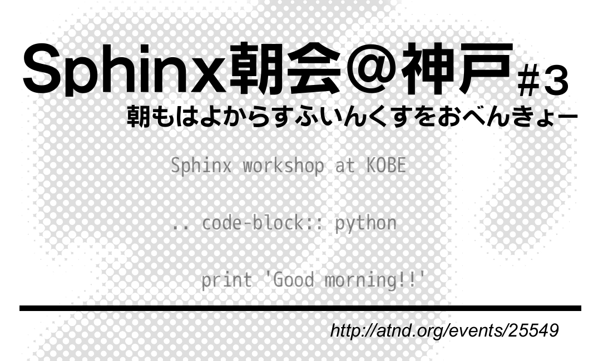

西のほうで「Sphinx朝会」やってきたのさ
===========================================

お前誰よ?
----------------------

* TwitterID : @lab1092
* 神戸から来ました。
* 今流行りの職業、'えすいーさん'
* プログラムとかあまりしない(Excel/Wordと戯れている時間のほうが長い)
* でも **Python** はわりと好きです。

Sphinx朝会
----------------------

朝もはよからすふいんくすをおべんきょー

.. s6:: styles

    'div': {textAlign: 'center'},
    'div/img': {width: '80%'},

Sphinx朝会って?
----------------------
Sphinx朝会とは

* **Sphinx初心者向け** の
* 'make html'を体験するための
* (ハンズオン形式の)勉強会みたいなもの

です。(モヒカンさん向けじゃないよ)

3回行いました。
----------------------

今回で3回目の実施です。

* 第一回:兵庫・神戸 6名
* 第二回:大阪・十三 12名
* **第三回:兵庫・神戸** 9名

何をやったの?
----------------------

3回、演習を中心に基本的なところを。(内容は同じ)

* Sphinxの環境を作る
* はじめての'make html'
* 演習問題で学習する

こんな感じで。
----------------------

.. s6:: styles

    h2: {fontSize:'100%', textAlign:'center', margin:'30% auto'}

Sphinxについての紹介1
----------------------

**Sphinxとは何か？**

* ドキュメント生成のツール
* reStructuredText記法(Wikiっぽい?
* ページ間のリンクを自動生成
* 強力なコードハイライト
* HTML, PDF, ePub, htmlhelp, latex, man...

Sphinxについての紹介2
----------------------

**reStructuredText記法って?**

シンプルなテキストマークアップです。

.. code-block:: rst

   Sphinxとは何か？
   -----------------
   * ドキュメント生成のツール
   * reStructuredText記法(Wikiっぽい?
   * ページ間のリンクを自動生成
   * 強力なコードハイライト
   * HTML, PDF, ePub, htmlhelp, latex, man...

Sphinxについての紹介3
----------------------

**何が嬉しい?**

Sphinxでドキュメントを書くと…

* テキストエディタでサクサク書ける
* 文書の構造を保ってシンプルに書ける
* 強力なSphinx拡張も使える
* 様々なOSで動作

.. s6:: styles

    'ul/li': {display:'none'}

.. s6:: actions

    ['ul/li[0]', 'fade in', '0.3'],
    ['ul/li[1]', 'fade in', '0.3'],
    ['ul/li[2]', 'fade in', '0.3'],
    ['ul/li[3]', 'fade in', '0.3'],

Sphinxについての紹介4
----------------------

**テキストエディタでサクサク**

何せテキストなので、

* GitなどのVCSで管理可能
* コピペし放題（?）
* テキストエディタ上の見栄えが崩れにくいマークアップ

Sphinxについての紹介5
----------------------

**シンプルに書ける**

* マークアップはシンプル。
* インデントと改行が文書構造を表現

Sphinxについての紹介6
----------------------

**強力なSphinx拡張**

reSTructuredTextでなく、 **Sphinx** である必要。

* コードハイライト(pygments)
* 拡張テーマ(bizstyle,S6,etc...)
* blockdiag等

Sphinxについての紹介7
----------------------

**情報も充実のSphinx-Usres.jp。**

日本のコミュニティが活発。

* ユーザーグループのページ
* メーリングリスト

…Sphinx、皆さんご存知ですよね？ **Pyfes** 来てるくらいだし
----------------------------------------------------------------

.. s6:: styles

    h2: {fontSize:'100%', textAlign:'center', margin:'30% auto'}

やってみて気付いたこと
----------------------

* 大阪に需要あり、神戸だと少し遠いっぽい。
* 意外な参加者
* Macは意外と環境構築が大変

意外な参加者
------------

非Pythonistaの参加が多かった(ex. PHPer)

* PHPer 多かったよ
* 3回目神戸の時は3/9がPythonista
* 朝早いのはなんとかなりそう
* みんなドキュメントに苦労してるみたい

次は?
------------

* 多分大阪。
* 4月中にはやりたいなー
* 今度は実践編的何か
* ネタください(つーか講師やってください)
* よろしくおねがいします。

宣伝してもいいですか？
----------------------

.. s6:: styles

    h2: {fontSize:'100%', textAlign:'center', margin:'30% auto'}

神戸ITフェスティバル
----------------------

http://kobe-it-fes.org/

* 昨年動員(1日) 700名超 
* 10月5日(金)、10月6日(土) -> 1,500?

.. s6:: styles

    'div': {textAlign: 'right'},
    'div/img': {width: '25%'},

BLUG.jp
----------------------

http://blug.jp/

* 「ぶるぐじぇいぴー」と読みます。
* blender のユーザーグループです。
* 今日のOSC東京にもブース出してます

.. figure:: images/blugjp_card.jpg

.. s6:: styles

    'div': {textAlign: 'right'},
    'div/img': {width: '30%'},

Thanks for watching!!
----------------------

ホントはBlenderやりたいんだよね…

.. raw:: html

   
<iframe width="560" height="315" src="http://www.youtube.com/embed/Z8cUMsQFHp4" frameborder="0" allowfullscreen></iframe>

   
